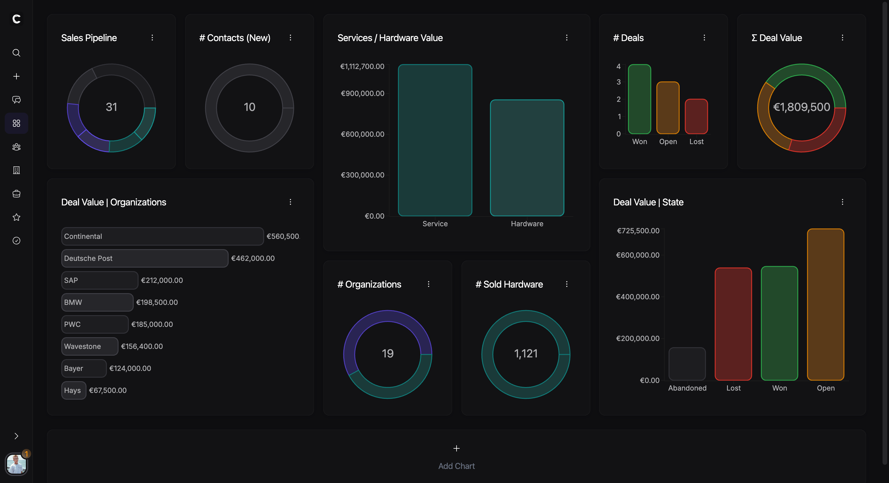
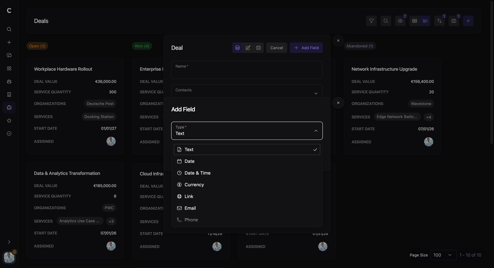
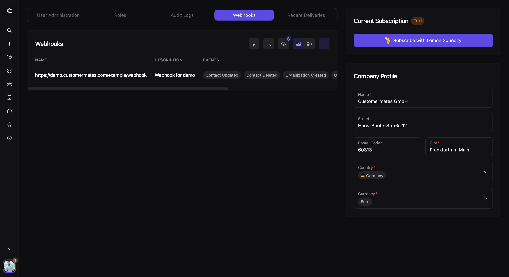
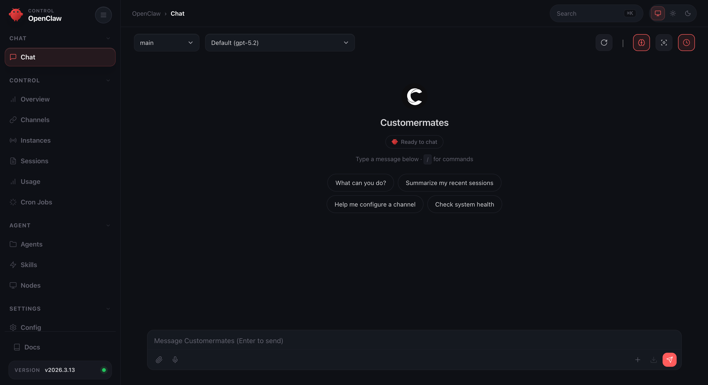

<p align="center">
  <picture>
    <source media="(prefers-color-scheme: dark)" srcset="public/images/dark/customermates.svg">
    <source media="(prefers-color-scheme: light)" srcset="public/images/light/customermates.svg">
    
  </picture>
</p>

<p align="center">Open Source CRM with AI agents, APIs, MCP, and self-hosting.</p>

<p align="center">
  <a href="https://customermates.com">Website</a> |
  <a href="https://demo.customermates.com">Demo</a> |
  <a href="https://customermates.com/docs">Documentation</a> |
  <a href="https://github.com/customermates/customermates">GitHub</a>
</p>

Customermates is a CRM for modern teams that want a clear system for contacts, organizations, deals, services, and tasks without the usual enterprise-heavy setup. It combines practical CRM workflows with API access, webhooks, n8n automation, MCP-based tooling, and AI-agent workflows.

You can use the managed cloud version or run Customermates yourself in your own infrastructure with Docker Compose.

## Getting Started

There are two ways to start using Customermates:

| Option | Description |
| --- | --- |
| **[Cloud](https://customermates.com)** | Fastest way to get started. Managed by Customermates. |
| **[Self-Hosting](https://customermates.com/docs/self-hosting)** | Run Customermates on your own server with Docker Compose and PostgreSQL. |

Docs entry points:

- [CRM Overview](https://customermates.com/docs)
- [Self-Hosted CRM vs Cloud CRM](https://customermates.com/docs/self-host-vs-cloud)
- [Self-Hosting Get Started](https://customermates.com/docs/self-hosting)
- [Managing Your Self-Hosted Installation](https://customermates.com/docs/managing-your-installation)
- [CRM Integrations](https://customermates.com/docs/integrations-intro)

## Key Features

- CRM for contacts, organizations, deals, services, and tasks
- API access with OpenAPI documentation
- Webhooks and event-driven integrations
- n8n workflows and automation support
- MCP support for agent tooling and structured tool calling
- AI-agent workflows and managed OpenClaw containers in cloud deployments
- Cloud-only enterprise features: Audit Logging, Single Sign-On, Managed AI Agent, and Whitelabeling
- Role-based access control for teams
- Self-hosted deployment with Docker Compose and PostgreSQL
- Cloud pricing from **€10**

## Feature Preview

### Dashboard & Widgets



### Custom Columns



### Webhooks & Events



### OpenClaw & AI Agents



See the related docs:

- [Dashboard & Widgets](https://customermates.com/docs/feature-guide-dashboard-widgets)
- [Custom Columns](https://customermates.com/docs/feature-guide-custom-columns)
- [Webhooks & Events](https://customermates.com/docs/feature-guide-webhooks-events)
- [OpenClaw & AI Agents](https://customermates.com/docs/openclaw-and-ai-agents)

## Comparison

Customermates supports both cloud and self-hosted deployment models.

| Criterion | Cloud | Self-Hosted |
| --- | --- | --- |
| Pricing | €10 | Infrastructure and ops costs vary |
| Setup Time | 2 minutes | 60 - 120 minutes |
| Maintenance Required | None | Regular updates |
| Privacy friendly | ✅ | ✅ |
| API and integrations | ✅ | ✅ |
| Unlimited Users | ✅ | ✅ |
| Unlimited Records | ✅ | ✅ |
| n8n and automation workflows | ✅ | ✅ |
| Audit Logging | ✅ | ❌ |
| Single Sign-On | ✅ | ❌ |
| Managed AI Agent | ✅ | ❌ |
| Whitelabeling | ✅ | ❌ |

If you want the full decision guide, see [Self-Hosted CRM vs Cloud CRM](https://customermates.com/docs/self-host-vs-cloud).

## Self-Hosting

Customermates can be deployed on your own infrastructure with Docker Compose.

### Prerequisites

- A VPS with Docker Engine and Docker Compose installed
- A domain pointing to your server
- PostgreSQL via Docker Compose
- A reverse proxy with HTTPS termination for production usage

### Setup

From the project root on your server:

```bash
cp .env.selfhost.template .env
chmod +x scripts/selfhost-setup.sh
./scripts/selfhost-setup.sh
```

Useful self-hosting scripts:

- `scripts/selfhost-setup.sh`
- `scripts/selfhost-update.sh`
- `scripts/selfhost-restart.sh`
- `scripts/selfhost-reset.sh`

More docs:

- [Self-Hosting Get Started](https://customermates.com/docs/self-hosting)
- [Managing Your Self-Hosted Installation](https://customermates.com/docs/managing-your-installation)

## Development

Run Customermates locally:

```bash
yarn install
yarn dev
```

Useful scripts:

- `yarn dev`
- `yarn build`
- `yarn lint`
- `yarn openapi:generate`
- `yarn db:reset`
- `yarn db:reseed`

## Documentation

The docs cover:

- product overview and CRM comparison
- self-hosting and operations
- API integrations and OpenAPI
- MCP and n8n
- entities, custom columns, webhooks, dashboards, and team settings

Start here: [customermates.com/docs](https://customermates.com/docs)

## License

Customermates uses an open-core licensing model.

The community edition is licensed under [AGPLv3](./LICENSE). Files in `ee/` are subject to the commercial terms in [`ee/LICENSE.md`](./ee/LICENSE.md).

Contributor terms are available in [`.github/CLA.md`](./.github/CLA.md).
